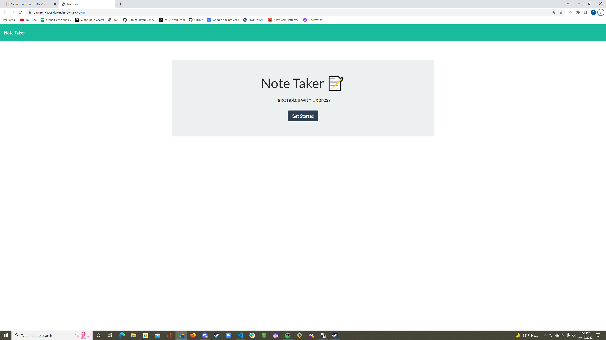
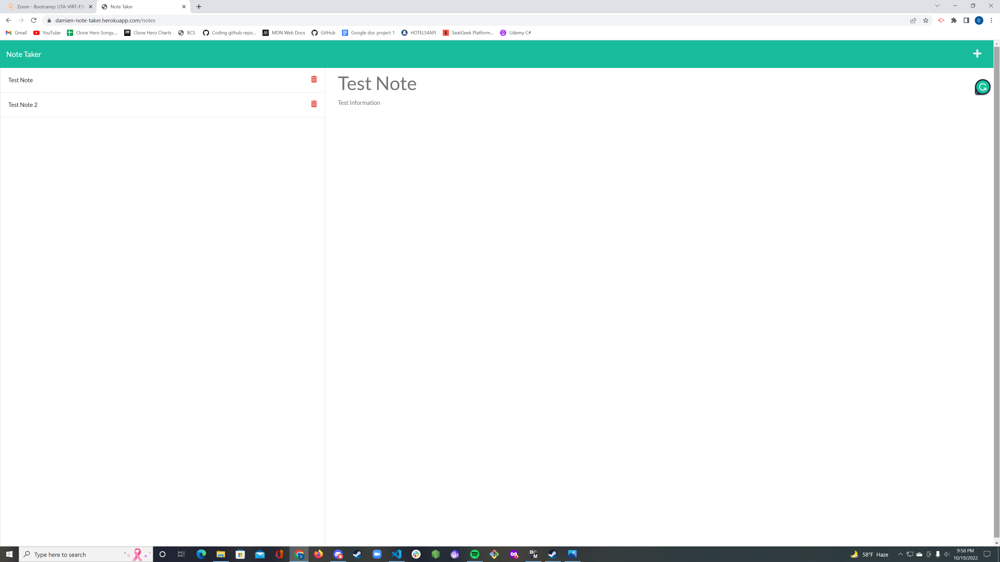
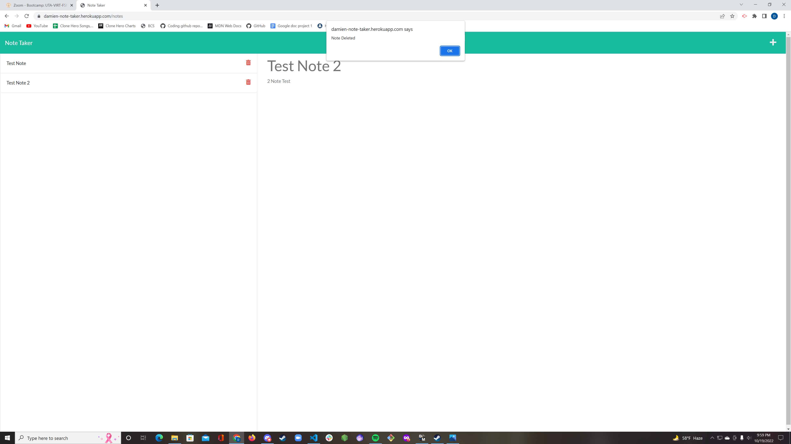

# Note-taker - Challenge 11

## Description

- This project utilizes Express.js to create a note-taking application that saves and displays persistent data from a JSON file.

- This project was created to better understand and implement Express.js, create rest endpoints, utilize GET, POST, and DELETE requests, as well as modular routing.

## Table of Contents

- [Installation](#installation)
- [Usage](#usage)
- [Credits](#credits)
- [License](#license)

## Installation

- Run this command to install Express:

```
    npm i
```

## Usage

If cloned locally run this command in the terminal to initialize application: 

```
    node server.js
```

Heroku Link: (https://damien-note-taker.herokuapp.com/)






## Credits

Collaborators:

- Adam Sherrill (https://github.com/ajsherrill2)

- Shelby Hernandez (https://github.com/shernandez927)

## License

MIT License

Copyright (c) [2022] [Damien Shoemake]

Permission is hereby granted, free of charge, to any person obtaining a copy
of this software and associated documentation files (the "Software"), to deal
in the Software without restriction, including without limitation the rights
to use, copy, modify, merge, publish, distribute, sublicense, and/or sell
copies of the Software, and to permit persons to whom the Software is
furnished to do so, subject to the following conditions:

The above copyright notice and this permission notice shall be included in all
copies or substantial portions of the Software.

THE SOFTWARE IS PROVIDED "AS IS", WITHOUT WARRANTY OF ANY KIND, EXPRESS OR
IMPLIED, INCLUDING BUT NOT LIMITED TO THE WARRANTIES OF MERCHANTABILITY,
FITNESS FOR A PARTICULAR PURPOSE AND NONINFRINGEMENT. IN NO EVENT SHALL THE
AUTHORS OR COPYRIGHT HOLDERS BE LIABLE FOR ANY CLAIM, DAMAGES OR OTHER
LIABILITY, WHETHER IN AN ACTION OF CONTRACT, TORT OR OTHERWISE, ARISING FROM,
OUT OF OR IN CONNECTION WITH THE SOFTWARE OR THE USE OR OTHER DEALINGS IN THE
SOFTWARE.


## Features

- Node.js

- Express.js